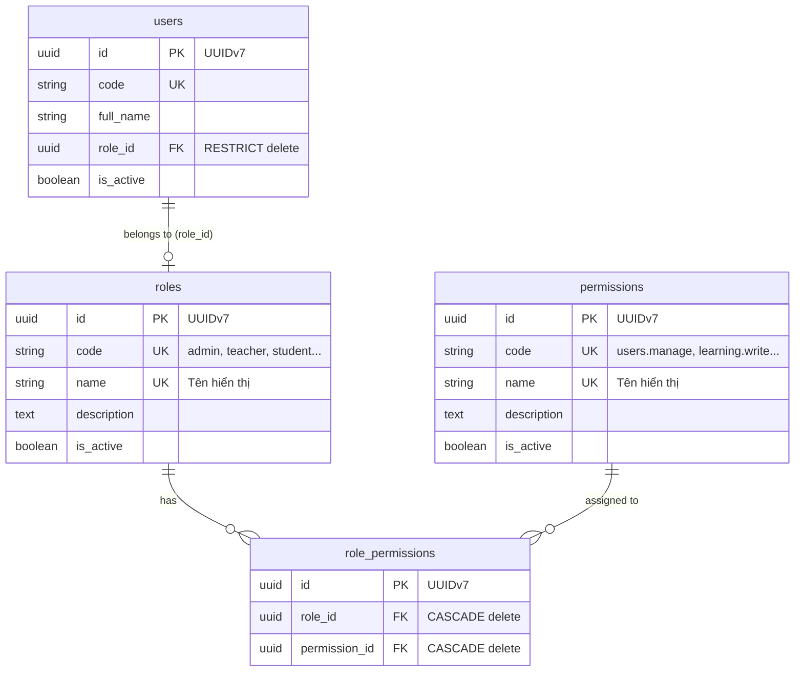

# ĐÁNH GIÁ KIẾN TRÚC RBAC HIỆN TẠI & BẢN ĐỀ XUẤT SCALE HỆ THỐNG PHÂN QUYỀN

Tài liệu này phân tích chi tiết hiện trạng hệ thống phân quyền (RBAC - Role-Based Access Control) trên cả 3 tầng (**Database, Backend, Frontend**) của dự án `fe-kt-latest` & `kata_edu-be`, phân tích phương án dùng **Role theo số (1, 2, 3, 4, 5, 6, 7, 8, 9)**, lập bảng so sánh đa chiều và đưa ra kiến trúc khuyến nghị tối ưu nhất để bạn học hỏi và tái sử dụng cho các website khác.

---

## PHẦN 1: BÁO CÁO KHẢO SÁT HIỆN TRẠNG HỆ THỐNG HIỆN TẠI

### 1. Tầng Database (PostgreSQL + TypeORM)

Hệ thống đang triển khai mô hình **RBAC cấp độ phân quyền chi tiết (Fine-grained Dynamic RBAC)** thông qua bảng trung gian (Many-to-Many) giữa Vai trò và Quyền hạn.



#### Đặc điểm kỹ thuật Database:
1. **Khóa chính**: Dùng `UUIDv7` (thời gian + ngẫu nhiên, tối ưu đánh index B-Tree hơn UUIDv4).
2. **Quan hệ User -> Role**: Hiện tại là **1 - 1 (Một người dùng chỉ có đúng 1 vai trò)** qua cột `users.role_id`. Khóa ngoại đặt `onDelete: 'RESTRICT'` để ngăn xóa nhầm role đang có user trực thuộc.
3. **Quan hệ Role -> Permission**: Là quan hệ **Nhiều - Nhiều (Many-to-Many)** qua bảng `role_permissions` với ràng buộc duy nhất `@Unique(['roleId', 'permissionId'])`.
4. **Quy chuẩn mã quyền (Permission Code)**: Đặt theo namespace dot-notation chuẩn RESTful:
   - Quản lý chung: `users.manage`, `rbac.manage`, `classes.manage`
   - Quan sát log: `request-logs.read`, `audit-logs.read`
   - Nghiệp vụ học tập: `learning.read`, `learning.write`, `learning.publish`, `learning.delete`, `learning.assign`, `learning.attempt`, `learning.media.upload`, `learning.manage`.

---

### 2. Tầng Backend (NestJS + TypeORM + JWT)

Backend hiện tại áp dụng mô hình xác thực và ủy quyền kết hợp qua Decorator và Guard:

#### Cơ chế luồng hoạt động (Control Flow):
1. **Đăng nhập (`AuthService.login`)**:
   - Khi login thành công, hệ thống nạp User cùng quan hệ `role.permissions.permission`.
   - Sinh Access Token JWT (thời hạn 15 phút) mang payload:
     ```json
     {
       "sub": "018f7f76-0000-7000-8000-000000000001",
       "roleCode": "admin",
       "permissions": ["users.manage", "rbac.manage", "learning.manage", ...],
       "tokenType": "access"
     }
     ```
2. **Bảo vệ Endpoint (`JwtAuthGuard` & `PermissionsGuard`)**:
   - **`JwtAuthGuard`**: Đọc header `Bearer token`, xác thực JWT signature. 
     > ⚠️ *Điểm cần lưu ý về hiệu năng*: Trong code hiện tại (`jwt-auth.guard.ts`), mỗi request đều gọi `userRepository.findOne` kèm relation `role.permissions` để tải dữ liệu mới nhất từ DB vào `request.user`.
   - **`PermissionsGuard`**: 
     - Kiểm tra Decorator `@Roles(...)`: So sánh với `user.roleCode`.
     - Kiểm tra Decorator `@Permissions(...)`: So sánh với danh sách `user.permissions`.
     - **Có logic bao trùm (Hierarchical Super-permission)**:
       ```typescript
       private hasPermission(userPermissions: string[], requiredPermission: string) {
         if (userPermissions.includes(requiredPermission)) return true;
         // Quyền learning.manage bao trùm tất cả các quyền learning.*
         return requiredPermission.startsWith('learning.') && userPermissions.includes('learning.manage');
       }
       ```
3. **Cung cấp API Quản trị Ma trận Phân quyền**:
   - `GET /role-permissions/matrix`: Trả về toàn bộ ma trận (danh sách roles, permissions, và cặp ghép nối).
   - `PUT /role-permissions/matrix`: Đồng bộ (sync) ma trận từ giao diện người dùng, giúp Admin thay đổi quyền của bất kỳ Role nào ngay trong thời gian thực mà không cần sửa code BE.

---

### 3. Tầng Frontend (React + Vite + Ant Design)

#### Cơ chế quản lý quyền ở Client:
1. **Lưu trữ & Khởi tạo (`AuthContext.tsx`)**:
   - Lưu trữ state `user` gồm: `role: user.role.code` và `permissions: user.role.permissions`.
   - Cung cấp 2 hàm tiện ích:
     - `hasRole(roles: string | string[])`: Kiểm tra vai trò của user.
     - `hasPermission(permissions: string | string[])`: Kiểm tra danh sách quyền (yêu cầu thỏa mãn tất cả - `every`).
2. **Bảo vệ Điều hướng (`ProtectedRoute.tsx` & `App.tsx`)**:
   - `<ProtectedRoute roles={["admin"]}>`: Chặn truy cập route cấp cao.
   - Định tuyến phân nhánh theo vai trò: `/admin/*`, `/teacher/*`, `/student/*`.
3. **Giao diện Ma trận Phân quyền (`RbacManagement.tsx`)**:
   - Cung cấp màn hình quản trị trực quan với bảng ma trận 2 chiều (Hàng = Quyền hạn, Cột = Vai trò).
   - Admin chỉ cần click vào các checkbox để Bật/Tắt quyền hạn cho vai trò đó rồi bấm nút "Lưu thay đổi" (gọi `PUT /role-permissions/matrix`).

#### ⚠️ Tồn tại hạn chế ở FE hiện tại:
- Mặc dù hệ thống đã có `hasPermission()`, nhưng phần lớn component giao diện (`Profile.tsx`, `Header.tsx`, các nút bấm sửa/xóa) vẫn đang **hardcode theo role** (`if (user.role === 'admin')`, `hasRole('student')`). 
- Điều này dẫn đến: Nếu Admin vào ma trận bỏ bớt quyền của `teacher`, giao diện giáo viên vẫn có thể hiển thị menu/nút đó (chỉ khi bấm vào gọi API mới bị BE chặn 403).

---

## PHẦN 2: PHÂN TÍCH PHƯƠNG ÁN "ROLE THEO SỐ (1, 2, 3... 9 Ở DATABASE)"

Phương án định nghĩa Role bằng số thường xuất hiện dưới 2 dạng thiết kế chính:

### Dạng 1: Phân cấp bậc số nguyên (Hierarchical Integer Enum)
*Ví dụ*:
- `1`: Super Admin (Toàn quyền)
- `2`: Admin chi nhánh / Quản lý
- `3`: Trưởng bộ môn / Quản lý nội dung
- `4`: Giáo viên
- `5`: Trợ giảng
- `9`: Học sinh / Khách vãng lai

**Cơ chế kiểm tra quyền**: Dựa vào toán tử so sánh thứ bậc (Hierarchy comparison):
```typescript
// Chỉ cần role <= 2 là được xem doanh thu / quản lý user
if (user.roleLevel <= 2) {
  allowAccess();
}
```

### Dạng 2: Mặt nạ nhị phân (Bitwise Flags / Bitmask)
*Mỗi quyền hoặc role là một lũy thừa của 2:*
- `1` ($2^0$): VIEW
- `2` ($2^1$): CREATE
- `4` ($2^2$): EDIT
- `8` ($2^3$): DELETE
- `16` ($2^4$): ADMIN
*User có quyền Edit + View thì DB lưu số*: $1 + 4 = 5$. Kiểm tra: `(user.role & 4) === 4`.

---

### Đánh giá Ưu & Nhược điểm của phương án Role theo số:

#### ✅ Ưu điểm:
1. **Siêu nhẹ và tối ưu dung lượng DB**: Cột `role` chỉ cần kiểu `SMALLINT` hoặc `TINYINT` (1 - 2 bytes), nhẹ hơn nhiều so với `VARCHAR(50)` hoặc `UUID` (16 bytes).
2. **Truy vấn & Đánh Index cực nhanh**: So sánh số nguyên là phép toán CPU cơ bản nhanh nhất trong database engine.
3. **Dễ viết code nhanh cho hệ thống phân cấp tuyến tính (Linear Hierarchy)**: Nếu hệ thống vận hành kiểu "Cấp trên có toàn bộ quyền của cấp dưới" (Cấp 1 > Cấp 2 > Cấp 3), bạn chỉ cần dùng toán tử `>=` hoặc `<=`.
4. **Phù hợp với dự án nhỏ / MVP / Hệ thống ít thay đổi nghiệp vụ**: Cấu trúc đơn giản, không cần tạo bảng `roles`, `permissions`, `role_permissions`.

#### ❌ Nhược điểm chí mạng khi Scale sang các Website khác:
1. **Magic Numbers ("Code Smell")**:
   - Nhìn vào DB thấy `role = 3`, không ai biết đó là ai nếu không mở tài liệu hoặc file `enum.ts` trong code.
   - Khi viết câu lệnh SQL debug/báo cáo: `SELECT * FROM users WHERE role = 4` rất dễ nhầm lẫn.
2. **Không thể hiện được quan hệ ngang hàng (Orthogonal Roles)**:
   - Trong thực tế, các website lớn không hoạt động theo thứ bậc tuyến tính. Ví dụ:
     - **Kế toán (Accountant)**: Xem hóa đơn, không được sửa khóa học.
     - **Biên tập viên (Editor)**: Soạn khóa học, không được xem doanh thu.
     - **Chăm sóc khách hàng (CSKH)**: Xem thông tin user, không được duyệt bài.
   - Lúc này, bạn gán Kế toán là số mấy? Editor số mấy? Số nào lớn hơn số nào? Số học hoàn toàn bất lực trong việc biểu diễn các vai trò độc lập theo chức năng.
3. **Triệt tiêu khả năng tùy biến động (No Dynamic Admin Matrix)**:
   - Nếu khách hàng hoặc Admin muốn tạo một vai trò mới (ví dụ: "Cộng tác viên chấm thi") với một vài quyền hạn đặc thù, phương án số **bắt buộc lập trình viên phải sửa code, định nghĩa số mới, sửa enum và deploy lại toàn bộ BE & FE**.
4. **Rủi ro vỡ hệ thống khi chèn role mới**:
   - Nếu bạn đã quy định `1: Admin, 2: Manager, 3: Staff`, sau này phát sinh `Assistant Manager` cần nằm giữa 2 và 3, bạn sẽ phải dịch chuyển lại toàn bộ số hoặc dùng số lẻ (2.5), gây lỗi dây chuyền các logic `< 3` đã viết khắp nơi.

---

## PHẦN 3: BẢNG SO SÁNH TỔNG THỂ CÁC MÔ HÌNH PHÂN QUYỀN

| Tiêu chí | Mô hình Role theo số (Integer Enum / Level) | Mô hình hiện tại của hệ thống (Role Code + Dynamic Matrix) | Mô hình Hybrid Chuẩn Scale Doanh nghiệp (Enterprise RBAC + Claims Cache) |
| :--- | :--- | :--- | :--- |
| **Cấu trúc Database** | Cực kỳ đơn giản: 1 cột `role: smallint` trong bảng `users`. | 4 bảng: `users`, `roles`, `permissions`, `role_permissions` (Dùng UUID). | 5 bảng: `users`, `roles`, `permissions`, `role_permissions`, `user_roles` (Hỗ trợ 1 user nhiều role). |
| **Độ linh hoạt nghiệp vụ** | 🔴 Kém. Chỉ phù hợp khi vai trò cố định và phân cấp 1 chiều. | 🟢 Rất cao. Có thể thêm/sửa quyền, map quyền qua UI Matrix. | 🟢 Tuyệt đối. Vừa có Role-Permission, vừa gán trực tiếp quyền lẻ cho User nếu cần. |
| **Hỗ trợ Admin UI** | 🔴 Không. Cần dev sửa code backend/frontend mỗi khi thêm quyền. | 🟢 Có sẵn. Đã có trang UI Ma trận phân quyền trực quan. | 🟢 Có sẵn. Quản lý phân quyền đa tầng, phân quyền theo phòng ban/chi nhánh (Multi-tenant). |
| **Hiệu năng Database** | 🟢 Cực nhanh. So sánh số nguyên, không cần `JOIN`. | 🟡 Cần tối ưu. Hiện tại `JwtAuthGuard` đang `JOIN 3 bảng` ở mỗi request. | 🟢 Cực nhanh. Giải mã quyền trực tiếp từ JWT Payload hoặc cache Redis (0 query DB). |
| **Độ trong sáng của mã nguồn (DX)** | 🔴 Kém. Dễ dính "Magic Number", phụ thuộc Mapping Enum ở 2 đầu FE & BE. | 🟢 Tốt. Tên quyền rõ ràng (`learning.write`, `users.manage`). | 🟢 Rất tốt. Chuẩn hóa Policy/Action-based (chuẩn CASL hoặc AccessControl). |
| **Độ phức tạp triển khai** | 🟢 Thấp nhất (Viết vài giờ là xong). | 🟡 Trung bình (Cần dựng bảng, guard, UI ma trận). | 🔴 Cao (Cần dựng cơ chế cache invalidation, token refresh sync). |
| **Khả năng Scale đa website / SaaS** | 🔴 Rất khó tái sử dụng cho các dự án phức tạp. | 🟢 Khá tốt để nhân bản sang web khác. | 🟢 Tốt nhất. Là chuẩn công nghiệp cho B2B SaaS. |

---

## PHẦN 4: ĐÁNH GIÁ ĐIỂM NGHẼN CẦN NÂNG CẤP TỪ HỆ THỐNG HIỆN TẠI

Trước khi bạn đem kiến trúc của hệ thống này sang website khác, bạn **bắt buộc phải biết 4 điểm nghẽn (Bottlenecks)** sau trong mã nguồn hiện tại để không lặp lại:

### 1. Bottleneck BE: Query Database liên tục ở mỗi request
- **Vấn đề**: Trong file `kata_edu-be/src/common/guards/jwt-auth.guard.ts`, với **mọi request HTTP** đi qua guard, hệ thống lại thực hiện:
  ```typescript
  const user = await this.userRepository.findOne({
    where: { id: payload.sub, isActive: true },
    relations: { role: { permissions: { permission: true } } },
  });
  ```
- **Hậu quả khi scale**: Khi website có 1.000 user online cùng lúc, DB PostgreSQL sẽ phải gánh hàng nghìn query `JOIN` bảng mỗi giây chỉ để kiểm tra quyền -> **DB nghẽn CPU và sập trước khi ứng dụng scale được**.

### 2. Bottleneck Data Model: Mỗi User chỉ có đúng 1 Role
- **Vấn đề**: Cột `users.role_id` khóa cứng mỗi user chỉ thuộc 1 vai trò duy nhất.
- **Thực tế scale**: Một tài khoản có thể vừa là `Teacher` (dạy lớp A), vừa là `Course Creator` (biên soạn đề), hoặc vừa là `Parent` vừa là `Teacher`. Cần chuyển thành bảng trung gian `user_roles` (Many-to-Many).

### 3. Bottleneck FE: Kiểm tra cứng Role thay vì Permission
- **Vấn đề**: Ở giao diện Frontend, nhiều component vẫn dùng `user.role === 'teacher'`, `hasRole('admin')` thay vì dùng `hasPermission('learning.write')`.
- **Hậu quả**: Khi Admin dùng Ma trận quyền để tước quyền "Tạo bài học" của một Giáo viên cụ thể, giao diện của Giáo viên đó vẫn hiện nút bấm "Tạo bài học" (chỉ khi bấm gửi mới bị BE báo lỗi 403).

### 4. Thiếu kiểm tra sở hữu tài nguyên (Data Ownership / ABAC)
- **Vấn đề**: Hiện tại chỉ kiểm tra quyền tĩnh dạng `learning.write`. 
- **Lỗ hổng**: Giáo viên A có quyền `learning.write`, nhưng liệu Giáo viên A có được quyền sửa đề thi do Giáo viên B tạo không? Hệ thống hiện tại chưa tích hợp logic kiểm tra: `item.createdById === currentUser.id`.

---

## PHẦN 5: BẢN ĐỀ XUẤT KIẾN TRÚC TỐI ƯU ĐỂ SCALE SANG WEBSITE MỚI (RECOMMENDATION)

### 1. Lời khuyên chọn lựa phương án:

- **CHỈ NÊN DÙNG Role dạng số khi**:
  - Bạn làm dự án nhỏ, landing page đơn giản, ứng dụng nội bộ chỉ có đúng 2-3 role cố định suốt đời dự án (ví dụ: `0: User, 1: Admin`).
  - Hoặc bạn làm hệ thống phân cấp thành viên (VIP Levels: `1: Đồng, 2: Bạc, 3: Vàng, 4: Kim Cương`).

- **NÊN DÙNG Mô hình RBAC mở rộng (Dựa trên hệ thống này nhưng đã tối ưu) khi**:
  - Bạn xây dựng website thương mại điện tử, giáo dục (LMS/EdTech), SaaS B2B, phần mềm quản lý (ERP/CRM).
  - Khách hàng muốn phân quyền linh hoạt cho từng nhân viên/vị trí công việc mà không cần code thêm.

---

### 2. Thiết kế Cơ sở Dữ liệu Chuẩn hóa (Database Schema Mẫu)

Dưới đây là DDL PostgreSQL chuẩn tối ưu sẵn sàng copy cho dự án mới:

```sql
-- 1. Bảng Vai trò
CREATE TABLE roles (
    id VARCHAR(36) PRIMARY KEY, -- hoặc UUIDv7
    code VARCHAR(50) UNIQUE NOT NULL, -- vd: 'admin', 'editor', 'moderator'
    name VARCHAR(100) NOT NULL,
    description TEXT,
    is_system BOOLEAN DEFAULT FALSE, -- Nếu true, không cho xóa role này qua UI
    is_active BOOLEAN DEFAULT TRUE,
    created_at TIMESTAMP WITH TIME ZONE DEFAULT CURRENT_TIMESTAMP,
    updated_at TIMESTAMP WITH TIME ZONE DEFAULT CURRENT_TIMESTAMP
);

-- 2. Bảng Quyền hạn (Permissions)
CREATE TABLE permissions (
    id VARCHAR(36) PRIMARY KEY,
    code VARCHAR(100) UNIQUE NOT NULL, -- vd: 'orders.create', 'products.delete'
    module VARCHAR(50) NOT NULL,       -- Gom nhóm trên UI: 'orders', 'products'
    name VARCHAR(100) NOT NULL,
    description TEXT,
    created_at TIMESTAMP WITH TIME ZONE DEFAULT CURRENT_TIMESTAMP
);

-- 3. Bảng Gán Quyền cho Vai trò (Role - Permission Matrix)
CREATE TABLE role_permissions (
    role_id VARCHAR(36) REFERENCES roles(id) ON DELETE CASCADE,
    permission_id VARCHAR(36) REFERENCES permissions(id) ON DELETE CASCADE,
    PRIMARY KEY (role_id, permission_id)
);

-- 4. Bảng Gán Vai trò cho Người dùng (User có thể có nhiều Role)
CREATE TABLE user_roles (
    user_id VARCHAR(36) REFERENCES users(id) ON DELETE CASCADE,
    role_id VARCHAR(36) REFERENCES roles(id) ON DELETE CASCADE,
    PRIMARY KEY (user_id, role_id)
);

-- 5. Bảng Quyền ngoại lệ cấp trực tiếp cho cá nhân (User Direct Permission - Tùy chọn nâng cao)
CREATE TABLE user_permissions (
    user_id VARCHAR(36) REFERENCES users(id) ON DELETE CASCADE,
    permission_id VARCHAR(36) REFERENCES permissions(id) ON DELETE CASCADE,
    is_granted BOOLEAN DEFAULT TRUE, -- true: cấp thêm quyền, false: tước quyền dù role có
    PRIMARY KEY (user_id, permission_id)
);
```

---

### 3. Tối ưu Backend Guard (Giải quyết triệt để vấn đề hiệu năng)

Thay vì query database ở mỗi request, hãy đưa danh sách `roles` và `permissions` vào **JWT Payload** kết hợp **Redis Caching**:

```typescript
// NestJS Guard tối ưu: 0 query DB cho mỗi request thông thường
@Injectable()
export class FastJwtAuthGuard implements CanActivate {
  constructor(private readonly jwtService: JwtService) {}

  async canActivate(context: ExecutionContext): Promise<boolean> {
    const request = context.switchToHttp().getRequest();
    const token = this.extractToken(request);
    if (!token) throw new UnauthorizedException('Token required');

    // Xác thực chữ ký và giải mã payload trực tiếp (cực nhanh trong RAM)
    const payload = await this.jwtService.verifyAsync(token);
    
    // Gán thông tin trực tiếp từ Token mà không cần query Database!
    request.user = {
      id: payload.sub,
      roles: payload.roles,         // ['admin', 'manager']
      permissions: payload.permissions, // ['orders.read', 'orders.write']
    };

    return true;
  }
}
```

> **Cách xử lý khi Admin đổi quyền trên Ma trận**:
> - Khi Admin cập nhật ma trận quyền ở endpoint `PUT /role-permissions/matrix`:
>   1. Backend lưu vào DB.
>   2. Backend tăng `auth_version` của User trong Redis (hoặc dùng Redis blacklist / Event).
>   3. Ở request kế tiếp, nếu token hết hạn (15 phút) hoặc gọi `/auth/refresh`, token mới sẽ tự động nhận danh sách quyền mới.

---

### 4. Tối ưu Frontend: Component Phân Quyền Khai Báo (Declarative Authorization)

Trên giao diện React, hãy tạo component bọc `<Can>` hoặc directive để ẩn/hiện nút bấm dựa theo **Permission** thay vì **Role**:

```tsx
// src/components/Can.tsx
import React from 'react';
import { useAuth } from '../contexts/AuthContext';

interface CanProps {
  perform: string | string[]; // Mã quyền: vd 'learning.write'
  fallback?: React.ReactNode;
  children: React.ReactNode;
}

export const Can: React.FC<CanProps> = ({ perform, fallback = null, children }) => {
  const { hasPermission } = useAuth();
  
  if (!hasPermission(perform)) {
    return <>{fallback}</>;
  }

  return <>{children}</>;
};

// Sử dụng trong các màn hình (cực kỳ sạch sẽ và dễ scale):
<Can perform="users.manage">
  <Button type="primary" onClick={handleCreateUser}>
    Tạo người dùng mới
  </Button>
</Can>

<Can perform="learning.delete">
  <Button danger onClick={handleDeleteExam}>
    Xóa đề thi
  </Button>
</Can>
```

---

## TỔNG KẾT

1. **Hệ thống hiện tại**: Là một kiến trúc **Dynamic RBAC hoàn chỉnh và chuyên nghiệp**, có ma trận quản trị trực quan, mã quyền dot-notation rõ ràng. Đây là nền tảng rất tốt để tái sử dụng.
2. **Phương án Role theo số (1..9)**: **Không khuyến nghị** cho các website cần scale nhiều phân hệ vì sẽ gặp bế tắc khi xử lý các vai trò độc lập, không cho phép Admin tự tạo vai trò trên UI và tạo ra "magic numbers" khó bảo trì.
3. **Khi mang sang website khác**: Hãy tái sử dụng mô hình RBAC của dự án này, nhưng áp dụng 3 cải tiến chiến lược:
   - Chuyển `users.role_id` thành quan hệ nhiều-nhiều `user_roles`.
   - Bỏ query DB trong `JwtAuthGuard`, nạp quyền vào JWT payload/Redis để đạt hiệu năng hàng triệu request/ngày.
   - Viết component `<Can perform="...">` ở Frontend để ẩn hiện UI chuẩn theo quyền hạn thay vì kiểm tra role cứng.
